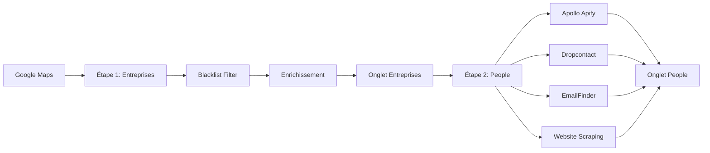

# 🗺️ Guide du Scraper en 2 Étapes

## Architecture Moderne : Entreprises → People

Ce nouveau système sépare clairement le scraping des **entreprises** et la recherche de **contacts**, avec des colonnes séparées par source pour une traçabilité complète.

---

## 📋 Workflow



---

## 1️⃣ Étape 1 : Scraper les Entreprises

### 🎯 Objectif
Récupérer les entreprises depuis Google Maps et les enrichir avec des données officielles.

### 🔧 Fonctionnement
1. **Scraping Google Maps** (via Apify)
2. **Filtrage Blacklist** - Exclut les grandes chaînes récurrentes
3. **Enrichissement** - SIRET, effectifs, CA (API entreprise.data.gouv.fr)
4. **Export** → Onglet **"Entreprises"** dans Google Sheets

### 📊 Colonnes de l'onglet "Entreprises"
| Colonne | Description |
|---------|-------------|
| Nom | Nom de l'entreprise |
| Adresse | Adresse complète |
| Ville | Ville |
| Téléphone | Numéro de téléphone |
| Site Web | URL du site |
| Note Google | Note moyenne Google Maps |
| Nombre Avis | Nombre d'avis |
| Catégorie | Catégorie d'activité |
| URL Google Maps | Lien vers la fiche |
| SIRET | Numéro SIRET |
| SIREN | Numéro SIREN |
| Forme Juridique | SARL, SAS, etc. |
| Effectifs | Nombre d'employés |
| CA Estimé | Chiffre d'affaires |
| Date Création | Date de création |
| Date Ajout | Date d'ajout au système |
| Statut | nouveau, en_cours, terminé |
| Nb Contacts Trouvés | Nombre de contacts trouvés |

### 💻 Utilisation

**Interface Streamlit** :
```bash
streamlit run app_two_step.py
```

**Code Python** :
```python
from scraper_two_step import TwoStepScraper

scraper = TwoStepScraper()

# Scraper les entreprises
companies = scraper.scrape_companies(
    search_query="fabricants de vérandas à Paris",
    max_results=50,
    location="Île-de-France"  # Optionnel
)

print(f"{len(companies)} entreprises scrapées")
```

---

## 2️⃣ Étape 2 : Chercher les Contacts

### 🎯 Objectif
Pour chaque entreprise de l'onglet "Entreprises", trouver des contacts qualifiés via **4 sources** différentes.

### 🔧 Fonctionnement
1. **Lecture** - Récupère les entreprises depuis l'onglet
2. **Apollo Apify** (prioritaire) - Contacts vérifiés B2B
3. **Dropcontact** (fallback) - Si Apollo ne trouve rien
4. **EmailFinder** - Construction intelligente d'emails
5. **Website Scraping** - Extraction depuis les sites web
6. **Export** → Onglet **"People"** avec **colonnes séparées par source**

### 📊 Colonnes de l'onglet "People"

#### Identification
| Colonne | Description |
|---------|-------------|
| Nom Entreprise | Nom de l'entreprise (FK) |
| Domaine | Domaine du site web |
| Nom Contact | Nom complet du contact |
| Fonction | Poste occupé |
| Localisation | Ville/région |

#### Source 1 : Apollo Apify (🔵 Prioritaire)
| Colonne | Description |
|---------|-------------|
| Email Apollo | Email trouvé par Apollo |
| Conf. Apollo | Confiance (high/medium/low) |
| Tel Apollo | Téléphone Apollo |
| LinkedIn Apollo | Profil LinkedIn |

#### Source 2 : Dropcontact (🟢 Fallback)
| Colonne | Description |
|---------|-------------|
| Email Dropcontact | Email trouvé par Dropcontact |
| Conf. Dropcontact | Confiance |
| Tel Dropcontact | Téléphone Dropcontact |

#### Source 3 : EmailFinder (🟡 Construction)
| Colonne | Description |
|---------|-------------|
| Email Construit | Email construit intelligemment |
| Pattern | Pattern utilisé (prenom.nom@, etc.) |
| Conf. Construit | Confiance du pattern |

#### Source 4 : Website Scraping (🟠 Extraction)
| Colonne | Description |
|---------|-------------|
| Email Scrapé | Email trouvé sur le site |
| Conf. Scrapé | Confiance |

#### Métadonnées
| Colonne | Description |
|---------|-------------|
| Source Principale | apollo, dropcontact, constructed, scraped |
| Email Meilleur | Email avec la meilleure confiance |
| Conf. Meilleure | Confiance du meilleur email |
| Toutes Sources | Liste de toutes les sources utilisées |
| Date Ajout | Date d'ajout |

### 💻 Utilisation

**Interface Streamlit** :
```bash
streamlit run app_two_step.py
```

**Code Python** :
```python
from scraper_two_step import TwoStepScraper

scraper = TwoStepScraper()

# Chercher les contacts
contacts = scraper.scrape_people(
    job_titles=["CEO", "Gérant", "Directeur Commercial"],
    max_contacts_per_company=3
)

print(f"{len(contacts)} contacts trouvés")
```

---

## 🚫 Système de Blacklist

### 🎯 Objectif
Éviter de scraper les mêmes grandes chaînes présentes partout (ex: Leroy Merlin, Point.P, etc.)

### 📁 Fichier
`company_blacklist.json`

### 💻 Utilisation

**Interface Streamlit** :
- Sidebar → Section "Blacklist Entreprises"
- Voir/Modifier/Ajouter

**Code Python** :
```python
from company_blacklist import CompanyBlacklist

bl = CompanyBlacklist()

# Ajouter des entreprises
bl.add("Leroy Merlin")
bl.add_multiple(["Akena Véranda", "Vie & Véranda"])

# Filtrer une liste
companies = [...]
filtered = bl.filter_companies(companies, name_key='name')

# Vérifier si blacklistée
if bl.is_blacklisted("Akena Véranda"):
    print("Cette entreprise est blacklistée")
```

### 📝 Exemple de Blacklist (Vérandas)
```json
{
  "blacklist": [
    "véranda rideau",
    "akena véranda",
    "vie & véranda",
    "gustave rideau",
    "technal",
    "tryba",
    "point.p",
    "leroy merlin"
  ]
}
```

---

## 🔵 Apollo Apify Scraper (Prioritaire)

### 🎯 Pourquoi Apollo via Apify ?
- ✅ **Meilleure qualité** de données B2B
- ✅ **Emails vérifiés** (status: verified/guessed)
- ✅ **Pas de limite** de crédits Apollo
- ✅ **Téléphones + LinkedIn** inclus
- ✅ **$0.70 / 1000 contacts** environ

### ⚙️ Configuration
1. Obtenir une clé API Apify : https://apify.com
2. Ajouter dans `.env` :
   ```
   APIFY_API_TOKEN=votre_token_apify
   ```

### 💻 Utilisation directe
```python
from apollo_apify_scraper import ApolloApifyScraper

scraper = ApolloApifyScraper()

# Chercher des contacts
contacts = scraper.search_people(
    company_name="Stripe",
    job_titles=["CEO", "CTO", "VP Engineering"],
    max_results=5
)

for contact in contacts:
    print(f"{contact['name']} - {contact['email']}")
```

---

## 📊 Google Sheets : 2 Onglets

### Onglet "Entreprises"
- 1 ligne = 1 entreprise
- Données Google Maps + enrichissement
- Statut de traitement

### Onglet "People"
- 1 ligne = 1 contact
- **Colonnes séparées par source**
- Traçabilité complète

---

## ⚡ Avantages du Système

| Avantage | Description |
|----------|-------------|
| 🎯 **Séparation claire** | Entreprises et contacts sont séparés |
| 🚫 **Blacklist** | Évite les doublons des grandes chaînes |
| 🔵 **Apollo prioritaire** | Meilleure qualité de données |
| 📊 **Colonnes par source** | Traçabilité complète |
| 💰 **Économique** | Ne recherche les contacts qu'une fois |
| 🔄 **Ré-exécutable** | Peut relancer Étape 2 sans re-scraper Étape 1 |

---

## 🚀 Démarrage Rapide

1. **Installer les dépendances** :
   ```bash
   pip install apify-client gspread oauth2client python-dotenv
   ```

2. **Configurer `.env`** :
   ```
   APIFY_API_TOKEN=votre_token
   GOOGLE_SHEET_ID=votre_sheet_id
   ```

3. **Lancer l'interface** :
   ```bash
   streamlit run app_two_step.py
   ```

4. **Étape 1** : Scraper les entreprises
5. **Étape 2** : Chercher les contacts

---

## 📝 Notes

- **Apollo Apify** est le scraper **prioritaire** pour la qualité
- Les **colonnes séparées** permettent de voir toutes les sources
- La **blacklist** est persistante dans `company_blacklist.json`
- Consultez `scraper_two_step.py` pour le code complet

---

## 🆘 Support

Pour toute question sur ce système :
1. Consultez les logs dans l'interface Streamlit
2. Vérifiez `company_blacklist.json` pour la blacklist
3. Testez avec `python scraper_two_step.py`
